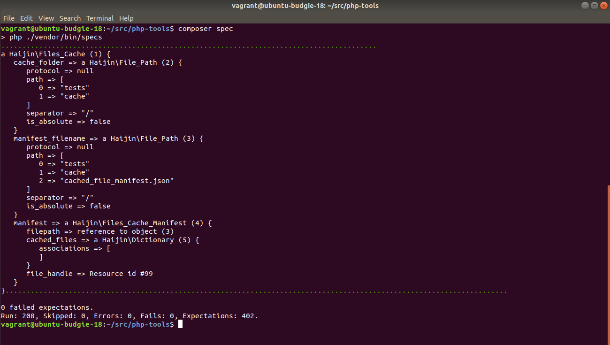

# Haijin Tools

Common tools to use in PHP applications.

[](https://packagist.org/packages/haijin/tools)
[](https://travis-ci.org/haijin-development/php-tools)
[](https://packagist.org/packages/haijin/tools)

### Version 2.0.0

If you like it a lot you may contribute by [financing](https://github.com/haijin-development/support-haijin-development) its development.

## Table of contents

1. [Installation](#c-1)
2. [Available tools](#c-2)
    1. [AttributePath](#c-2-1)
    2. [FilePath](#c-2-2)
    3. [Object accessor](#c-2-3)
    4. [OrderedCollection](#c-2-4)
    5. [Dictionary](#c-2-5)
    6. [FilesCache](#c-2-6)
    7. [Debugger](#c-2-7)
3. [Running the tests](#c-3)

<a name="c-1"></a>
## Installation

Include this library in your project `composer.json` file:

```json
{
    ...

    "require": {
        ...
        "haijin/tools": "^2.0",
        ...
    },

    ...
}
```

<a name="c-2"></a>
## Available tools

<a name="c-2-1"></a>
### AttributePath

An AttributePath is a sequence of attributes from a root object to a nested attribute of that object.

```php
$path = new AttributePath("user.address");
$path = $path->concat("street");

print $path->toString(); // "user.address.street"
print $path->toArray(); // ["user", "address", "street" ]

$user = [
    "name" => "Lisa",
    "lastName" => "Simpson",
    "address" => [
        "street" => null
    ]
];

$path->setValueTo($user, "Evergreen 742");
print $path->getValueFrom($user); // Evergreen 742

$path = $path->back();
print $path; // "user.address"
```

* [AttributePath protocol](./documentation/attribute-path.md).
* [AttributePath examples](./documentation/attribute-path-examples.php).

<a name="c-2-2"></a>
### FilePath

A path to a file or directory.

```php
$path = new FilePath("home/dev");
$path = $path->concat("src");

print $path->toString(); // "home/dev/src"
print $path->toArray(); // ["home", "dev", "src"]

$path = $path->back();
print $path; // "home/dev"
```

* [FilePath protocol](./documentation/attribute-path.md#c-3).
* [FilePath examples](./documentation/file-path-examples.php).

<a name="c-2-3"></a>
### Object accessor

A class to dynamically read and write objects, arrays and associative arrays attributes using a polimprophic interface.

```php
$user = [
    'name' => 'Lisa',
    'lastName' => 'Simpson',
    'addresses' => [
        [
            'street' => null
        ]
    ]
];

$accessor = new ObjectAttributeAccessor($user);
$accessor->setValueAt("addresses.[0].street", "Evergreen 742");
print $accessor->getValueAt("addresses.[0].street"); // Evergreen 742
```

* [ObjectAttributeAccessor protocol](./documentation/object-attribute-accessor.md).
* [ObjectAttributeAccessor examples](./documentation/object-attribute-accessor-examples.php).

<a name="c-2-4"></a>
### OrderedCollection

An alternative to using PHP arrays for indexed collections.

It is always passed by reference and has a consistent, simple and complete protocol.

```php
$orderedCollection = OrderedCollection::withAll([10, 20, 30]);
$orderedCollection[] = 40;

print $orderedCollection[0]; // => 10
print $orderedCollection[-1]; // => 40

print $orderedCollection->findFirst(function($sum, $each) {
    return $each > 20;
}); // 30

print $orderedCollection->select(function($each) {
    return $each > 20;
}); // [30, 40]

print $orderedCollection->collect(function($each) {
    return $each + 1;
}); // [11, 21, 31, 41]


print $orderedCollection->acummulate(0, function($sum, $each) {
    return $sum = $sum + $each;
}); // 100

$orderedCollection->eachDo(function($each) {
    print $each . " ";
}); // 10, 20, 30, 40 

print $orderedCollection->removeAt(0); // 10
```

* [OrderedCollection protocol](./documentation/ordered-collection.md).

<a name="c-2-5"></a>
### Dictionary

An alternative to using PHP arrays for associative collections.

It is always passed by reference and has a consistent, simple and complete protocol.


```php
$dictionary = new Dictionary();
$dictionary['a'] = 10;
$dictionary['b'] = 20;

print $dictionary->getKeys(); // => ['a', 'b']
print $dictionary->getValues(); // => [10, 20]

print $dictionary['a']; // => 10

print $dictionary->atIfAbsent('c', function() {
    return 0;
}); // 0

print $dictionary->atIfAbsent('c', 0); // 0

$dictionary->keysAndValuesDo(function($key, $value) {
    print $key . " => " . $value . ", ";
}); // 'a' => 10, 'b' => 20,  

print $dictionary->removeAt('a'); // 10
```

* [Dictionary protocol](./documentation/dictionary.md).


<a name="c-2-6"></a>
### FilesCache

A very simple cache directory for files.

Example of using it to cache generated content for cached files:

```php
use Haijin\FilesCache;

$cache = new FilesCache()

$cache->setCacheFolder("resources/css");

$cache->lockingDo(function($cache) use($sassFilename) {

    if($cache->needsCaching($sassFilename)) {

        $cssContents = $this->sassToCss(file_get_contents($sassFilename));

        $cache->writeFileContents(
            $sassFilename,
            $cssContents,
            $filename . ".css"
        );

    }

    return $this->cache->getPathOf($sassFilename);

});
```

Example of using it to cache copied files from a resource directory to a public one:

```php
use Haijin\FilesCache;

$cache = new FilesCache()

$cache->setCacheFolder("public/css");

$cache->lockingDo(function($cache) use($filename) {

    if ($cache->needsCaching($filename)) {

        $cache->writeFile(
            $filename,
            $filename
        );

    }

    return $this->cache->getPathOf($filename);

});
```

<a name="c-2-7"></a>
## Debugger

Recursively inspect any value, array or object with `\Haijin\Debugger`.



For console and files logging:

```php
echo \Haijin\Debugger::inspect($object);
```

For html logging:

```php
echo \Haijin\Debugger::webInspect($object);
```

For abbreviation in the file `tests\specsBoot.php` define the function

```php
function inspect($object)
{
    \Haijin\Debugger::inspect($object);
}
```

and in the specs use

```php
\inspect($filesCache);
```

<a name="c-3"></a>
## Running the tests

```
composer specs
```

Or if you want to run the tests using a Docker with PHP 7.2:

```
sudo docker run -ti -v $(pwd):/home/php-tools --rm --name php-tools haijin/php-dev:7.2 bash
cd /home/php-tools/
composer install
composer specs
```